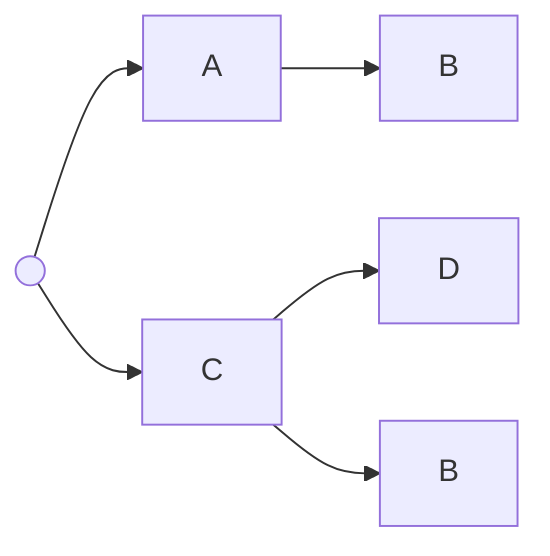

# Plumb

**This library is work in progress!**

Composable data validation, coercion and processing in Ruby. Takes over from [https://github.com/ismasan/parametric](https://github.com/ismasan/parametric)

This library takes ideas from the excellent [https://dry-rb.org](https://dry-rb.org) ecosystem, with some of the features offered by Dry-Types, Dry-Schema, Dry-Struct. However, I'm aiming at a subset of the functionality with a (hopefully) smaller API surface and fewer concepts, focusing on lessons learned after using Parametric in production for many years.

If you're after raw performance and versatility I strongly recommend you use the Dry gems.

For a description of the core architecture you can read [this article](https://ismaelcelis.com/posts/composable-pipelines-in-ruby/).

Some use cases in the [examples directory](https://github.com/ismasan/plumb/tree/main/examples)

## Installation

Install in your environment with `gem install plumb`, or in your `Gemfile` with

```ruby
gem 'plumb'
```

## Usage

### Include base types.

Include base types in your own namespace:

```ruby
module Types
  # Include Plumb base types, such as String, Integer, Boolean
  include Plumb::Types
  
  # Define your own types
  Email = String[/@/]
end

# Use them
result = Types::String.resolve("hello")
result.valid? # true
result.errors # nil

result = Types::Email.resolve("foo")
result.valid? # false
result.errors # ""
```

Note that this is not mandatory. You can also work with the `Plumb::Types` module directly, ex. `Plumb::Types::String`

### Specialize your types with `#[]`

Use `#[]` to make your types match a class.

```ruby
module Types
  include Plumb::Types
  
  String = Any[::String]
  Integer = Any[::Integer]
end

Types::String.parse("hello") # => "hello"
Types::String.parse(10) # raises "Must be a String" (Plumb::ParseError)
```

Plumb ships with basic types already defined, such as `Types::String` and `Types::Integer`. See the full list below.

The `#[]` method is not just for classes. It works with anything that responds to `#===`

```ruby
# Match against a regex
Email = Types::String[/@/] # ie Types::Any[String][/@/]

Email.parse('hello') # fails
Email.parse('hello@server.com') # 'hello@server.com'

# Or a Range
AdultAge = Types::Integer[18..]
AdultAge.parse(20) # 20
AdultAge.parse(17) # raises "Must be within 18.."" (Plumb::ParseError)

# Or literal values
Twenty = Types::Integer[20]
Twenty.parse(20) # 20
Twenty.parse(21) # type error
```

It can be combined with other methods. For example to cast strings as integers, but only if they _look_ like integers.

```ruby
StringToInt = Types::String[/^\d+$/].transform(::Integer, &:to_i)

StringToInt.parse('100') # => 100
StringToInt.parse('100lol') # fails
```

### `#resolve(value) => Result`

`#resolve` takes an input value and returns a `Result::Valid` or `Result::Invalid`

```ruby
result = Types::Integer.resolve(10)
result.valid? # true
result.value # 10

result = Types::Integer.resolve('10')
result.valid? # false
result.value # '10'
result.errors # 'must be an Integer'
```

### `#parse(value) => value`

`#parse` takes an input value and returns the parsed/coerced value if successful. or it raises an exception if failed.

```ruby
Types::Integer.parse(10) # 10
Types::Integer.parse('10') # raises Plumb::ParseError
```


### Composite types

Some built-in types such as `Types::Array` and `Types::Hash` allow defininig array or hash data structures composed of other types.

```ruby
# A user hash
User = Types::Hash[name: Types::String, email: Email, age: AdultAge]

# An array of User hashes
Users = Types::Array[User]

joe = User.parse({ name: 'Joe', email: 'joe@email.com', age: 20}) # returns valid hash
Users.parse([joe]) # returns valid array of user hashes
```

More about [Types::Hash](#typeshash) and [Types::Array](#typesarray). There's also [tuples](#typestuple), [hash maps](#maps), [data structs](#typesdata) and [streams](#typesstream), and it's possible to create your own composite types.

### Type composition

At the core, Plumb types are little [Railway-oriented pipelines](https://ismaelcelis.com/posts/composable-pipelines-in-ruby/) that can be composed together with _AND_ (`#>>`), _OR_ (`#|`) and _NOT_ (`#not`) semantics, plus set-style _intersection_ (`#&`). Everything else builds on top of these ideas.

#### Composing types with `#>>` ("And")

```ruby
Email = Types::String[/@/]
# You can compose procs and lambdas, or other types.
Greeting = Email >> ->(result) { result.valid("Your email is #{result.value}") }

Greeting.parse('joe@bloggs.com') # "Your email is joe@bloggs.com"
```

Similar to Ruby's built-in [function composition](https://thoughtbot.com/blog/proc-composition-in-ruby), `#>>` pipes the output of a "type" to the input of the next type. However, if a type returns an "invalid" result, the chain is halted there and subsequent steps are never run. 

In other words, `A >> B` means "if A succeeds, pass its result to B. Otherwise return A's failed result."

`#>>` also **type-checks the composition** at build time: if the left side could never produce a value the right side accepts, the chain is a dead end and it raises `Plumb::TypeError` before any data flows through. See [Composition type-checks](#composition-type-checks).

#### A plain callable between two types

A proc declares no types, so on its own it's an opaque step. Written *between* two types, those types move into its boundaries and the chain becomes a single typed function:

```ruby
Doubled = Types::Integer >> ->(result) { result.valid(result.value * 2) } >> Types::Integer

Doubled.inspect             # => "(Types::Integer -> Types::Integer)"
Doubled.input_type          # => Types::Integer
Doubled.output_type         # => Types::Integer
Doubled.parse(3)            # => 6
Doubled.resolve('3').errors # => "Must be a Integer"
```

The checks are the ones you wrote — the input validated before the callable runs, the output after — but they run as one node's boundaries instead of a three-step chain, and the result reports what it accepts and produces, so it keeps composing (and type-checking) downstream. Either half works on its own: `Types::Integer >> a_proc` is `(Types::Integer -> Plumb::Types::Any)`, typed on the side you declared.

Nothing is dropped to do this: a type only moves into a boundary the step left undeclared, so it runs exactly where the no-op ran. That includes a type that *builds* a value, so a struct pipeline collapses the same way:

```ruby
Person  = Types::Data[name: Types::String]
Renamer = Person >> ->(r) { r.valid(r.value.with(name: r.value.name.upcase)) } >> Person

Renamer.inspect                 # => "(Person -> Person)"
Renamer.parse(name: 'ada').name # => "ADA"
Renamer.resolve(name: 42).errors # => {name: "Must be a String"}
```

What keeps its own node is a step that declares what it accepts, or one carrying its own callable — two of those meeting is transform fusion's business rather than absorption's:

```ruby
# The transform declares String as its input, so the leading gate stays a step.
(Types::String >> Types::String.transform(::Integer, &:to_i)).inspect
# => "(Types::String >> (Types::String -> Integer))"
```

#### Disjunction with `#|` ("Or")

`A | B` means "if A returns a valid result, return that. Otherwise try B with the original input."

```ruby
StringOrInt = Types::String | Types::Integer
StringOrInt.parse('hello') # "hello"
StringOrInt.parse(10) # 10
StringOrInt.parse({}) # raises Plumb::ParseError
```

Custom default value logic for non-emails

```ruby
EmailOrDefault = Greeting | Types::Static['no email']
EmailOrDefault.parse('joe@bloggs.com') # "Your email is joe@bloggs.com"
EmailOrDefault.parse('nope') # "no email"
```

#### Composing with `#>>` and `#|`

Combine `#>>` and `#|` to compose branching workflows, or types that accept and output several possible data types.

`((A >> B) | C | D) >> E)`

This more elaborate example defines a combination of types which, when composed together with `>>` and `|`, can coerce strings or integers into Money instances with currency. It also shows some of the built-in [policies](#policies) or helpers.

```ruby
require 'money'

module Types
  include Plumb::Types
  
  # Match any Money instance
  Money = Any[::Money]
  
  # Transform Integers into Money instances
  IntToMoney = Integer.transform(::Money) { |v| ::Money.new(v, 'USD') }
  
  # Transform integer-looking Strings into Integers
  StringToInt = String.match(/^\d+$/).transform(::Integer, &:to_i)
  
  # Validate that a Money instance is USD
  USD = Money.check { |amount| amount.currency.code == 'UDS' }
  
  # Exchange a non-USD Money instance into USD
  ToUSD = Money.transform(::Money) { |amount| amount.exchange_to('USD') }
  
  # Compose a pipeline that accepts Strings, Integers or Money and returns USD money.
  FlexibleUSD = (Money | ((Integer | StringToInt) >> IntToMoney)) >> (USD | ToUSD)
end

FlexibleUSD.parse('1000') # Money(USD 10.00)
FlexibleUSD.parse(1000) # Money(USD 10.00)
FlexibleUSD.parse(Money.new(1000, 'GBP')) # Money(USD 15.00)
```

You can see more use cases in [the examples directory](https://github.com/ismasan/plumb/tree/main/examples)

#### Intersection with `#&` and the `Never` type

`A & B` is the **intersection** (the greatest lower bound) of two types: it describes values that satisfy **both**. Unlike `#>>`, it is symmetric (order-independent) and never raises — where the two types can't overlap it produces `Types::Never` (see below).

Where it can, `#&` narrows to the exact overlap:

```ruby
Types::Integer[2..] & Types::Integer[0..100]   # => Integer[2..100]  (ranges intersected)
Types::Integer[1, 2, 3] & Types::Integer[2, 3, 4] # => Integer[Set[2, 3]]
Types::Integer & Types::Numeric                # => Integer          (keeps the narrower)
```

It distributes over unions and intersects covariant containers element-wise:

```ruby
Types::Array[Types::Integer | Types::Float] & Types::Array[Types::Float] # => Array[Float]
Types::Integer | (Types::String & Types::Integer)                        # => Integer
```

When the intersection is provably empty, the result is `Types::Never`:

```ruby
Types::String & Types::Integer                 # => Types::Never  (no value is both)
Types::Integer[2..10] & Types::Integer[11..100] # => Types::Never  (disjoint ranges)
```

Chaining refinements with `#[]` (or `#where`) is the same intersection, so a provably-empty chain reduces to `Types::Never` too:

```ruby
Types::Integer[0..5][10..]                       # => Types::Never  (== Integer[0..5] & Integer[10..])
Types::String.where(size: 0..5).where(size: 10..) # => Types::Never  (unsatisfiable clause)
```

When it can neither narrow nor prove emptiness, `#&` falls back to a runtime intersection that validates the value through both sides.

`Types::Hash#&` ([Hash intersections](#hash-intersections)) and `Types::Interface#&` ([Intersecting interfaces](#intersecting-interfaces)) are the record- and interface-specific cases of the same operator.

##### `Types::Never`

`Types::Never` is the **bottom type** — the dual of the `Types::Any` top. No value inhabits it, so it always fails validation, and it collapses out of compositions:

```ruby
Types::Any     & Types::Integer   # => Integer  (Any is the identity of &)
Types::Integer & Types::Never     # => Types::Never  (Never absorbs &)
Types::Integer | Types::Never     # => Integer       (Never is dropped from |)

Types::Never.resolve(42).valid?   # => false  (nothing is a Never)
Types::Never.to_json_schema       # => { "not" => {} }
```

You rarely write `Types::Never` by hand — it's what an impossible intersection reduces to, which lets the composition algebra prove and discard dead branches (as in `Integer | (String & Integer)` above). It's also useful as a Hash catch-all to forbid undeclared keys — see [`_: Types::Never`](#undeclared-keys-and-the-_-catch-all).

### Built-in types

* `Types::Value`
* `Types::Array`
* `Types::True`
* `Types::Symbol`
* `Types::Boolean`
* `Types::Interface`
* `Types::False`
* `Types::Tuple`
* `Types::Any`
* `Types::Static`
* `Types::Undefined`
* `Types::Nil`
* `Types::Integer`
* `Types::Numeric`
* `Types::String`
* `Types::Hash`
* `Types::Range`
* `Types::SymbolizedHash`
* `Types::UUID::V4`
* `Types::Email`
* `Types::Date`
* `Types::Time`
* `Types::URI::Generic`
* `Types::URI::HTTP`
* `Types::URI::File`
* `Types::Lax::Integer`
* `Types::Lax::String`
* `Types::Lax::Symbol`

For parsing stringy formats (HTML forms, query strings) into these types — what the `Types::Forms` namespace used to do, one way — see `Plumb::Codec::Forms` under [Encoders and Codecs](#encoders-and-codecs).

TODO: datetime, others.

### Policies

Policies are helpers that encapsulate common compositions. Plumb ships with some handy ones, listed below, and you can also define your own.

#### `#present`

Checks that the value is not blank (`""` if string, `[]` if array, `{}` if Hash, or `nil`)

```ruby
Types::String.present.resolve('') # Failure with errors
Types::Array[Types::String].present.resolve([]) # Failure with errors
```

#### `#nullable`

Allow `nil` values.

```ruby
nullable_str = Types::String.nullable
nullable_srt.parse(nil) # nil
nullable_str.parse('hello') # 'hello'
nullable_str.parse(10) # ParseError
```

Note that this just encapsulates the following composition:

```ruby
nullable_str = Types::String | Types::Nil
```

#### `#not`

Negates a type. 
```ruby
NotEmail = Types::Email.not

NotEmail.parse('hello') # "hello"
NotEmail.parse('hello@server.com') # error
```

`#not` can also be given a type as argument, which might read better:

```ruby
Types::Any.not(nil)
Types::Any.not(Types::Email)
```

Finally, you can use `Types::Not` for the same effect.

```ruby
NotNil = Types::Not[nil]
NotNil.parse(1) # 1
NotNil.parse('hello') # 'hello'
NotNil.parse(nil) # error
```

#### `#options`

Sets allowed options for value.

```ruby
type = Types::String.options(['a', 'b', 'c'])
type.resolve('a') # Valid
type.resolve('x') # Failure
```

For arrays, it checks that all elements in array are included in options.

```ruby
type = Types::Array.options(['a', 'b'])
type.resolve(['a', 'a', 'b']) # Valid
type.resolve(['a', 'x', 'b']) # Failure
```

### `#where`

The `#where` helper matches attributes of the object with values, using `#===`.

```ruby
LimitedArray = Types::Array[String].where(size: 10)
LimitedString = Types::String.where(size: 10)
LimitedSet = Types::Any[Set].where(size: 10)
```

The size is matched via `#===`, so ranges also work.

```ruby
Password = Types::String.where(bytesize: 10..20)
```

The helper accepts multiple attribute/value pairs

```ruby
JoeBloggs = Types::Any[User].where(first_name: 'Joe', last_name: 'Bloggs')
```

Attribute constraints take part in [composition type-checks](#composition-type-checks): a constrained type is a subtype of its base, and a constraint on the same attribute is a subtype when its value is contained in the other's (compared like ranges/literals).

```ruby
Types::Array.where(size: 10) >> Types::Array                     # ok: constrained Array is still an Array
Types::Array.where(size: 10) >> Types::Array.where(size: 8..100) # ok: 10 is within 8..100
Types::Array.where(size: 10..15) >> Types::Array.where(size: 11..14) # raises: 10..15 isn't within 11..14
```

#### `#transform`

Transform value. Requires specifying the resulting type of the value after transformation.

```ruby
StringToInt = Types::String.transform(Integer) { |value| value.to_i }
# Same as
StringToInt = Types::String.transform(Integer, &:to_i)

StringToInteger.parse('10') # => 10
```

As a shorthand, `#transform` also accepts a single Ruby conversion symbol — `:to_s`, `:to_sym`, `:to_i`, `:to_f`, `:to_r`, `:to_c`, `:to_a`, `:to_h`, `:to_proc` — and infers the output type from it:

```ruby
Types::String.transform(:to_i)  # transform to Integer, via #to_i
Types::Integer.transform(:to_s) # transform to String
# equivalent to
Types::String.transform(Integer, &:to_i)
```

When the input's base Ruby type is known, it validates that the type actually responds to the method, so mistakes fail at build time:

```ruby
Types::Integer.transform(:to_sym) # raises Plumb::TypeError (Integer has no #to_sym)
Types::Any.transform(:to_i)       # ok — unknown input type, no check
```

`#transform` builds a [`Plumb::Function`](#plumbfunctioninput--output) — the underlying typed-conversion node — with a block that takes and returns a plain value. To build one standalone from a callable, or to work at the `Result` level, use `Plumb::Function[]` directly.

#### `#invoke`

`#invoke` builds a step that will invoke one or more methods on the value.

```ruby
StringToInt = Types::String.invoke(:to_i)
StringToInt.parse('100') # 100

FilteredHash = Types::Hash.invoke(:except, :foo, :bar)
FilteredHash.parse(foo: 1, bar: 2, name: 'Joe') # { name: 'Joe' }

# It works with blocks
Evens = Types::Array[Integer].invoke(:filter, &:even?)
Evens.parse([1,2,3,4,5]) # [2, 4]

# Same as
Evens = Types::Array[Integer].transform(Array) {|arr| arr.filter(&:even?) }
```

Passing an array of Symbol method names will build a chain of invocations.

```ruby
UpcaseToSym = Types::String.invoke(%i[downcase to_sym])
UpcaseToSym.parse('FOO_BAR') # :foo_bar
```

Note, as opposed to `#transform`, this helper does not declare a resulting output type (`#output_type`), which can be valuable for introspection or documentation (ex. JSON Schema).

Also, there's no definition-time checks that the method names are actually supported by the input values.

```ruby
type = Types::Array.invoke(:strip) # This is fine here
type.parse([1, 2]) # raises NoMethodError because Array doesn't respond to #strip
```

Use with caution.

#### `#default`

Default value when no value given (ie. when key is missing in Hash payloads. See `Types::Hash` below).

```ruby
str = Types::String.default('nope'.freeze)
str.parse() # 'nope'
str.parse('yup') # 'yup'
```

A block generates the value on every invocation, instead of returning a fixed one:

```ruby
id = Types::UUID::V4.default { SecureRandom.uuid }
id.parse() # a fresh UUID each time
```

The step _declares_ the type it defaults — so a `Types::Date.default { Date.today }`
is still a `Date` for subtyping, JSON Schema and [Codecs](#encoders-and-codecs) — and
what the block returns is checked against it, failing where it is defaulted rather
than somewhere downstream.

What is checked is the type's **output**, and the type itself is not re-run on the
generated value: a converting type expects the block to produce the converted value.

```ruby
int = Types::String.transform(::Integer, &:to_i)
int.default { 10 }.parse()    # 10
int.default { '10' }.parse()  # raises — a String is not what this type produces
```

Note that this is syntax sugar for:

```ruby
# A String, or if it's Undefined pipe to a static string value.
str = Types::String | (Types::Undefined >> Types::Static['nope'.freeze])
```

Meaning that you can compose your own semantics for a "default" value.

Example when you want to apply a default when the given value is `nil`.

```ruby
str = Types::String | (Types::Nil >> Types::Static['nope'.freeze])

str.parse(nil) # 'nope'
str.parse('yup') # 'yup'
```

Same if you want to apply a default to several cases.

```ruby
str = Types::String | ((Types::Nil | Types::Undefined) >> Types::Static['nope'.freeze])
```

#### `#build`

Build a custom object or class.

```ruby
User = Data.define(:name)
UserType = Types::String.build(User)

UserType.parse('Joe') # #<data User name="Joe">
```

It takes an argument for a custom factory method on the object constructor.

```ruby
# https://github.com/RubyMoney/monetize
require 'monetize'

StringToMoney = Types::String.build(Monetize, :parse)
money = StringToMoney.parse('£10,300.00') # #<Money fractional:1030000 currency:GBP>
```

You can also pass a block

```ruby
StringToMoney = Types::String.build(Money) { |value| Monetize.parse(value) }
```

Note that this case is identical to `#transform` with a block.

```ruby
StringToMoney = Types::String.transform(Money) { |value| Monetize.parse(value) }
```

#### `#check`

Pass the value through an arbitrary validation

```ruby
type = Types::String.check('must start with "Role:"') { |value| value.start_with?('Role:') }
type.parse('Role: Manager') # 'Role: Manager'
type.parse('Manager') # fails
```

####  `#value` 

Constrain a type to a specific value. Compares with `#==`

```ruby
hello = Types::String.value('hello')
hello.parse('hello') # 'hello'
hello.parse('bye') # fails
hello.parse(10) # fails 'not a string'
```

All scalar types support this:

```ruby
ten = Types::Integer.value(10)
```

#### `#static`

A type that always returns a valid, static value, regardless of input.

```ruby
ten = Types::Integer.static(10)
ten.parse(10) # => 10
ten.parse(100) # => 10
ten.parse('hello') # => 10
ten.parse() # => 10
```

Useful for data structures where some fields shouldn't change. Example:

```ruby
CreateUserEvent = Types::Hash[
  type: Types::String.static('CreateUser'),
  name: String,
  age: Integer
]
```

This usage is similar as using `Types::Static['hello']`directly.

This helper is shorthand for the following composition:

```ruby
Types::Static[value] >> step
```

Because the static value flows through the original step's type, an inconsistent value is caught at build time by the [composition check](#composition-type-checks):

```ruby
Types::Integer[100..].static(10) # raises Plumb::TypeError (10 is not within 100..)
type = Types::Integer[100..].static(150) # ok
```

So, normally you'd only use this attached to primitive types without further processing (but your use case may vary).

#### `#generate`

Passing a proc will evaluate the proc on every invocation. Use this for generated values.

```ruby
random_number = Types::Numeric.generate { rand }
random_number.parse # 0.32332
random_number.parse('foo') # 0.54322 etc
```

Note that the type of generated value must match the initial step's type, validated at invocation.

```ruby
random_number = Types::String.generate { rand } # this won't raise an error here
random_number.parse # raises Plumb::ParseError because `rand` is not a String
```

You can also pass any `#call() => Object` interface as a generator, instead of a proc.

#### `#metadata`

Add metadata to a type

```ruby
# A new type with metadata
type = Types::String.metadata(description: 'A long text')
# Read a type's metadata
type.metadata[:description] # 'A long text'
```

`#metadata` combines keys from type compositions.

```ruby
type = Types::String[/@/].metadata(note: 'An email address') >> Types::String.metadata(description: 'A long text')
type.metadata[:description] # 'A long text'
type.metadata[:note] # 'An email address'
```

`#metadata` only carries user-provided annotations. The Ruby type(s) a composition accepts and produces are described by `#input_type` and `#output_type` instead (see below).

TODO: document custom visitors.

#### `#input_type` and `#output_type`

Every type exposes the type it expects as input and the type it produces as output.

```ruby
StringToInt = Types::String.transform(Integer, &:to_i)
StringToInt.input_type  # Types::String
StringToInt.output_type # Integer
```

They resolve through a composition, reporting what the chain as a whole consumes and produces — not its individual steps. The steps themselves remain available as `#children`:

```ruby
chain = Types::String.transform(Integer, &:to_i) >> Types::Integer.transform(Integer) { |i| i * 2 }
chain.input_type  # Types::String — the chain can only be called with a String
chain.output_type # Integer       — it can only produce an Integer
chain.children    # [(Types::String -> Integer), (Types::Integer -> Integer)]
```

For a plain type, both are the type itself. Unions distribute over both sides:

```ruby
(Types::String | Types::Integer).input_type  # Types::String | Types::Integer
(Types::String | Types::Integer).output_type # Types::String | Types::Integer
```

These power type introspection — for example, the JSON Schema visitor builds its schema from `#input_type`, since a schema describes the values a caller must send.

#### Composition type-checks

`#>>` is typed by **subsumption**, like function composition in a statically-typed language: everything the left step *produces* must be acceptable to the right step — i.e. the left's output type must be a **subtype** of the right's input type. If not, `#>>` raises `Plumb::TypeError` at build time, so broken data pipelines fail loudly when you define them, not silently at runtime.

```ruby
Types::String  >> Types::Integer           # raises: String is not a subtype of Integer
Types::Numeric >> Types::Integer           # raises: Numeric is broader than Integer
Types::Integer[0..40] >> Types::Integer[2..10]   # raises: the left can emit values (0,1,11..40) the right rejects

Types::Integer >> Types::Numeric           # ok: every Integer is a Numeric
Types::Integer[2..10] >> Types::Integer[0..40]   # ok: 2..10 is within 0..40
```

To **narrow** a value — where only some of what the left produces should pass — use `#[]` (or `#transform(...)[...]`). A refinement is a runtime-checked cast, built directly, and is *not* subject to the composition check:

```ruby
Types::Integer[0..40][2..10]                       # narrow to 2..10 (runtime-checked)
Types::String.transform(Integer, &:to_i)[1..10]    # convert, then bound the result
```

For an arbitrary composition the checker can't prove — not just a matcher constraint — reach for `#/`, the unchecked counterpart of `#>>`. It builds the same refinement and is still validated at runtime, but skips the build-time check; you're asserting the chain is sound. It reads like `Pathname#/` ("join the next segment"):

```ruby
Types::Integer / Types::Integer[2..10]   # narrow without the build-time check
Types::String / Types::String[/@/]       # a String you assert is an email downstream
```

The check is permissive only where types are genuinely unknown: opaque steps (plain procs/lambdas, `#invoke`, `#generate`) and value-level transforms (`#transform`/`#build`) report `Any` on the relevant side and opt out. (`#static` ignores its input, so it never blocks a chain feeding *into* it, but it does declare the value it produces — so `Types::Static['foo'] >> Types::Integer` is flagged.)

For `Types::Hash` schemas, subsumption is record subtyping — the producer must provide every key the consumer requires (as a required key, with a subtype value); it may add extra keys:

```ruby
# the consumer requires :age, but the producer never provides it:
Types::Hash[name: Types::String] >> Types::Hash[name: Types::String, age: Types::Integer]
# => Plumb::TypeError

# a shared key whose value type isn't a subtype:
Types::Hash[name: Types::String] >> Types::Hash[name: Types::Integer]
# => Plumb::TypeError

# ok — producer is a subtype of consumer (wider, with subtype values):
Types::Hash[name: Types::Integer, age: Types::Integer] >> Types::Hash[name: Types::Numeric]
```

[`#where`](#where) attribute constraints subtype the same way — a constrained type is a subtype of its base, and a constraint is a subtype of a looser one on the same attribute:

```ruby
Types::Array.where(size: 10) >> Types::Array.where(size: 8..100)     # ok: 10 is within 8..100
Types::Array.where(size: 10..15) >> Types::Array.where(size: 11..14) # raises: 10..15 isn't within 11..14
```

#### Subtype checks: `#<=` and `Plumb::Subtyping`

The relation behind the composition check is also available directly. `a <= b` asks "is every value described by `a` also described by `b`?" — i.e. is `a` a subtype/subset of `b`? — with `>=`, `<` and `>` derived from it. `Plumb::Subtyping.subtype?(a, b)` is the same check as a method. Built-in and custom types both participate, and raw Ruby classes/values are accepted on either side (they're normalized):

```ruby
Types::Integer <= Types::Numeric                # true
Types::Numeric <= Types::Integer                # false
Types::String[/@/] <= Types::String             # true (more refined => a subset)
Types::Integer <= Numeric                       # true (compares against a raw Ruby class)
Types::Array[Integer] <= Types::Array[Numeric]  # true (covariant in the element type)

big   = Types::Hash[name: Types::String, age: Types::Integer]
small = Types::Hash[name: Types::String]
big <= small                                    # true (width + depth subtyping)
```

### Other policies

There's some other built-in "policies" that can be used via the `#policy` method. Helpers such as `#default` and `#present` are shortcuts for this and can also be used via `#policy(default: 'Hello')` or `#policy(:present)` See [custom policies](#custom-policies) for how to define your own policies.

#### `:respond_to`

Similar to `Types::Interface`, this is a quick way to assert that a value supports one or more methods.

```ruby
List = Types::Any.policy(respond_to: :each)
# or
List = Types::Any.policy(respond_to: [:each, :[], :size)
```

#### `:excluded_from`

The opposite of `#options`, this policy validates that the value _is not_ included in a list.

```ruby
Name = Types::String.policy(excluded_from: ['Joe', 'Joan'])
```

#### :split` (strings only)

Splits string values by a separator (default: `,`).

```ruby
CSVLine = Types::String.split
CSVLine.parse('a,b,c') # => ['a', 'b', 'c']

# Or, with custom separator
CSVLine = Types::String.split(/\s*;\s*/)
CSVLine.parse('a;b;c') # => ['a', 'b', 'c']
```

#### `:rescue`

Wraps a step's execution, rescues a specific exception and returns an invalid result.

Useful for turning a 3rd party library's exception into an invalid result that plays well with Plumb's type compositions.

Example: parsing strings with `Date.parse` and turning `Date::Error` exceptions into Plumb errors.

```ruby
# Accept a string that can be parsed into a Date
# via Date.parse
# If Date.parse raises a Date::Error, return a Result::Invalid with
# the exception's message as error message.
type = Types::String
	.build(::Date, :parse)
	.policy(:rescue, ::Date::Error)

type.resolve('2024-02-02') # => Result::Valid with Date object
type.resolve('2024-') # => Result::Invalid with error message
```

The guard keeps the type it wraps: the example above is still a `Date` for subtyping,
JSON Schema and [Codecs](#encoders-and-codecs).

### `Types::Interface`

Use this for objects that must respond to one or more methods.

```ruby
Iterable = Types::Interface[:each, :map]
Iterable.parse([1,2,3]) # => [1,2,3]
Iterable.parse(10) # => raises error
```

This can be useful combined with `case` statements, too:

```ruby
value = [1,2,3]
case value
when Iterable
  # do something with array
when Stringable
  # do something with string
when Readable
  # do something with IO or similar
end
```

Or pattern matching

```ruby
case args
  in [Iterable => list, String => id]
    # etc
  in [Resolvable => r]
    # etc
end
```

#### Merging interfaces

Use the `+` operator to merge two interfaces into a new one that must support both sets of method names.

```ruby
Iterable = Types::Interface[:each, :map]
Countable = Types::Interface[:size]
# This one expects objects with methods :each, :map and :size
CountableIterable = Iterable + Countable
```

#### Intersecting interfaces

Use the `&` operator to produce a new interface with the intersection of method names

```ruby
I1 = Types::Interface[:a, :b, :c]
I2 = Types::Interface[:b, :c, :d]
# This one expects methods :b and :c
I3 = Types::Interface[:b, :c]
```


TODO: make this a bit more advanced. Check for method arity.

### `Types::Hash`

```ruby
Employee = Types::Hash[
  name: Types::String.present,
  age?: Types::Lax::Integer,
  role: Types::String.options(%w[product accounts sales]).default('product')
]

Company = Types::Hash[
  name: Types::String.present,
  employees: Types::Array[Employee]
]

result = Company.resolve(
  name: 'ACME',
  employees: [
    { name: 'Joe', age: 40, role: 'product' },
    { name: 'Joan', age: 38, role: 'engineer' }
  ]
)

result.valid? # true

result = Company.resolve(
  name: 'ACME',
  employees: [{ name: 'Joe' }]
)

result.valid? # false
result.errors[:employees][0][:age] # ["must be a Numeric"]
```

Note that you can use primitives as hash field definitions.

```ruby
User = Types::Hash[name: String, age: Integer]
```

Or to validate specific values:

```ruby
Joe = Types::Hash[name: 'Joe', age: Integer]
```

Or to validate against any `#===` interface:

```ruby
Adult = Types::Hash[name: String, age: (18..)]
# Same as
Adult = Types::Hash[name: Types::String, age: Types::Integer[18..]]
```

If you want to validate literal values, pass a `Types::Value`

```ruby
Settings = Types::Hash[age_range: Types::Value[18..]]

Settings.parse(age_range: (18..)) # Valid
Settings.parse(age_range: (20..30)) # Invalid
```

A `Types::Static` value will always resolve successfully to that value, regardless of the original payload.

```ruby
User = Types::Hash[name: Types::Static['Joe'], age: Integer]
User.parse(name: 'Rufus', age: 34) # Valid {name: 'Joe', age: 34}
```

#### Optional keys

Keys suffixed with `?` are marked as optional and its values will only be validated and coerced if the key is present in the input hash.

```ruby
User = Types::Hash[
  age?: Integer,
  name: String
]

User.parse(age: 20, name: 'Joe') # => Valid { age: 20, name: 'Joe' }
User.parse(age: '20', name: 'Joe') # => Invalid, :age is not an Integer
User.parse(name: 'Joe') #=> Valid { name: 'Joe' }
```

Note that defaults are not applied to optional keys that are missing.

```ruby
Types::Hash[
  age?: Types::Integer.default(10), # does not apply default if key is missing  
  name: Types::String.default('Joe') # does apply default if key is missing.
]
```

#### Merging hash definitions

Use `Types::Hash#+` to merge two definitions. Keys in the second hash override the first one's.

```ruby
User = Types::Hash[name: Types::String, age: Types::Integer]
Employee = Types::Hash[name: Types::String, company: Types::String]
StaffMember = User + Employee # Hash[:name, :age, :company]
```

#### Hash intersections

Use `Types::Hash#&` to intersect two hash definitions as maps. It keeps the keys present in **both**, and intersects each shared key's value type:

```ruby
User & Employee # => Hash[name: String]  (only the shared :name survives)

# shared keys have their value types intersected
Types::Hash[age: Types::Integer[18..]] & Types::Hash[age: Types::Integer[..65]]
# => Hash[age: Integer[18..65]]
```

Two closed schemas that share no keys have nothing in common, so the intersection is `Types::Never` — the empty/bottom type, which no value satisfies:

```ruby
Types::Hash[a: Types::Integer] & Types::Hash[b: Types::String] # => Types::Never
```

A [`_` catch-all](#undeclared-keys-and-the-_-catch-all) widens what survives, since it admits the other side's extra keys:

```ruby
Types::Hash[a: Types::String, _: Types::Any] & Types::Hash[a: Types::String, b: Types::Integer]
# => Hash[a: String, b: Integer]  (:b admitted via the left's catch-all)
```

#### `Types::Hash#tagged_by`

Use `#tagged_by` to resolve what definition to use based on the value of a common key.

```ruby
NameUpdatedEvent = Types::Hash[type: 'name_updated', name: Types::String]
AgeUpdatedEvent = Types::Hash[type: 'age_updated', age: Types::Integer]

Events = Types::Hash.tagged_by(
  :type,
  NameUpdatedEvent,
  AgeUpdatedEvent
)

Events.parse(type: 'name_updated', name: 'Joe') # Uses NameUpdatedEvent definition
```

#### Undeclared keys and the `_` catch-all

By default, keys present in the input but **not** declared in the schema are dropped:

```ruby
Types::Hash[age: Types::Integer].parse(age: 30, name: 'Joe') # => { age: 30 }  (:name dropped)
```

To control what happens to those undeclared keys, add a special `_` key. It is a **catch-all**: its value type is applied to every key not otherwise declared. The value type you give it decides the behaviour:

| Catch-all | Meaning | Undeclared key `name`… |
| --- | --- | --- |
| _(none)_ | drop (default) | is removed |
| `_: Types::Any` | include, unchanged | is kept as-is |
| `_: SomeType` | include, validated/coerced | must be a `SomeType` (coerced if the type coerces) |
| `_: Types::Never` | exclude (strict) | is a validation **error** |

```ruby
# _: Any — keep every undeclared key, unchanged
hash = Types::Hash[age: Types::Lax::Integer, _: Types::Any]
hash.parse(age: '30', name: 'Joe', last_name: 'Bloggs')
# => { age: 30, name: 'Joe', last_name: 'Bloggs' }

# _: SomeType — every undeclared value must be (or coerce to) that type
Types::Hash[id: Types::String, _: Types::Integer].parse(id: 'x', a: 1, b: 2)
# => { id: 'x', a: 1, b: 2 }
Types::Hash[id: Types::String, _: Types::Integer].resolve(id: 'x', a: 'nope').valid? # => false

# _: Never — reject any undeclared key (a closed/strict hash)
strict = Types::Hash[a: Types::String, _: Types::Never]
strict.resolve(a: 'x').valid?          # => true
strict.resolve(a: 'x', b: 1).valid?    # => false  (b is not allowed)
```

`_: Any` is useful when you only care about validating some fields, or to assemble different front and back hashes — for example a client-facing one that validates JSON or form data, and a backend one that runs further coercions on some keys while passing the rest through:

```ruby
# Front-end definition does structural validation
Front = Types::Hash[price: Integer, name: String, category: String]

# Turn an Integer into a Money instance
IntToMoney = Types::Integer.build(Money)

# Backend definition turns :price into a Money object, leaves other keys as-is
Back = Types::Hash[price: IntToMoney, _: Types::Any]

# Compose the pipeline
InputHandler = Front >> Back

InputHandler.parse(price: 100_000, name: 'iPhone 15', category: 'smartphones')
# => { price: #<Money fractional:100000 currency:GBP>, name: 'iPhone 15', category: 'smartphones' }
```

The catch-all also shows up in generated JSON Schema as `additionalProperties`: `_: Any` → `{}` (anything), `_: Integer` → `{ "type": "integer" }`, and `_: Never` → `{ "not": {} }` (nothing allowed).

#### Typed keys

Keys are not limited to symbols. A key can be any type or matcher, and it matches an input key via `key === other`. So you can key by String, or by a pattern, and mix them with a catch-all:

```ruby
Types::Hash['name' => Types::String]                 # a String key
Types::Hash[Types::String[/^id_/] => Types::Integer, # keys matching /^id_/ hold Integers
            _: Types::Any]                           # everything else passes through
```

A typed key is **lenient**: input keys that don't match any declared or typed key follow the catch-all rule above (dropped by default). This is different from a homogeneous map (`Types::Hash[Types::Symbol, Types::Integer]`, a `HashMap` — note the comma, not `=>`), which is **strict** (a non-conforming key is an error) and coerces keys through the key type. Use a `HashMap` for "every key/value has this type"; use typed keys for "keys shaped like this map to that".

#### `Types::Hash#filtered`

The `#filtered` modifier returns a valid Hash with the subset of values that were valid, instead of failing the entire result if one or more values are invalid.

```ruby
User = Types::Hash[name: String, age: Integer].filtered
User.parse(name: 'Joe', age: 40) # => { name: 'Joe', age: 40 }
User.parse(name: 'Joe', age: 'nope') # => { name: 'Joe' }
```

### `Types::Range`

`Types::Range` validates that a value is a Ruby `Range`. On its own it accepts any range:

```ruby
Types::Range.resolve(1..10)     # valid
Types::Range.resolve('a'..'z')  # valid
Types::Range.resolve(5)         # invalid ("must be a Range")
```

Specialize it with `#[]` to constrain the range's endpoints. The member type is matched against both the range's `#begin` and `#end` (a `nil` bound — an open-ended range — is skipped):

```ruby
IntRange = Types::Range[Integer]
IntRange.resolve(1..10)     # valid
IntRange.resolve('a'..'z')  # invalid (endpoints aren't Integers)
IntRange.resolve(1..)       # valid (only the present bound is checked)
```

The member type is any `#===` interface, so a `Range` itself works as the member matcher to bound where the endpoints may fall:

```ruby
# A range whose endpoints both lie within 1..100
Percent = Types::Range[1..100]
Percent.resolve(10..20)   # valid
Percent.resolve(10..200)  # invalid (200 is outside 1..100)
```

#### Open-ended ranges with `#where`

Use `#where` with the `begin`/`end` attributes to constrain the range's own endpoints. Passing `end: nil` matches only endless ranges, and `begin: nil` only beginless ranges:

```ruby
# Endless ranges only, eg. (1..)
Endless = Types::Range[Integer].where(end: nil)
Endless.resolve(1..)    # valid
Endless.resolve(1..10)  # invalid ("must have attribute end === nil")

# Beginless ranges only, eg. (..10)
Beginless = Types::Range[Integer].where(begin: nil)
Beginless.resolve(..10)   # valid
Beginless.resolve(1..10)  # invalid
```

`#where` values are also full `#===` matchers, so an endpoint can be constrained by a type or another range:

```ruby
# A range that starts at zero or above
NonNegativeStart = Types::Range.where(begin: Types::Integer[0..])
NonNegativeStart.resolve(5..10)   # valid
NonNegativeStart.resolve(-5..10)  # invalid
```

#### Composition

`Types::Range` is covariant in its member type and preserves its input value (it validates endpoints without coercing them), so it composes like the other containers. A union absorbs a narrower member into a wider one:

```ruby
Types::Range[1..10] <= Types::Range[Integer]  # true (covariant)

# The narrower branch is absorbed
Types::Range[Integer] | Types::Range[1..10]   # => Range[Integer]
```

#### JSON Schema

A `Types::Range` whose member pins numeric bounds maps to JSON Schema's native keywords, preserving an exclusive end as `exclusiveMaximum`:

```ruby
Plumb::JSONSchemaVisitor.call(Types::Range[0...100], root: false)
# => { "type" => "integer", "minimum" => 0, "exclusiveMaximum" => 100 }
```

### `Types::SymbolizedHash`

This type turns a hash's keys into symbols by calling `#to_sym` on them, and returning a new Hash.

`SymbolizedHash` is a `Symbol => Any` map. You can use it as a _transform_.

```ruby
UserHash = Types::Hash[name: String]
Types::SymbolizedHash.transform(UserHash).parse('name' => 'Joe') # { name: 'Joe' }
```

You can also use the shortcut `#symbolized`

```ruby
# Symbolize keys, then coerce into a typed Hash.
type = Types::Hash[name: String, age: Integer].symbolized
type.parse('name' => 'Joe', 'age' => 20) # {name: 'Joe', age: 20}
```

###  maps

You can also use Hash syntax to define a hash map with specific types for all keys and values:

```ruby
currencies = Types::Hash[Types::Symbol, Types::String]

currencies.parse(usd: 'USD', gbp: 'GBP') # Ok
currencies.parse('usd' => 'USD') # Error. Keys must be Symbols
```

Like other types, hash maps accept primitive types as keys and values:

```ruby
currencies = Types::Hash[Symbol, String]
```

And any `#===` interface as values, too:

```ruby
names_and_emails = Types::Hash[String, /\w+@\w+/]

names_and_emails.parse('Joe' => 'joe@server.com', 'Rufus' => 'rufus')
```

Use `Types::Value` to validate specific values (using `#==`)

```ruby
names_and_ones = Types::Hash[String, Types::Integer.value(1)]
```

#### `#filtered`

Calling the `#filtered` modifier on a Hash Map makes it return a sub set of the keys and values that are valid as per the key and value type definitions.

```ruby
# Filter the ENV for all keys starting with S3_*
S3Config = Types::Hash[/^S3_\w+/, Types::Any].filtered

S3Config.parse(ENV.to_h) # { 'S3_BUCKET' => 'foo', 'S3_REGION' => 'us-east-1' }
```


### `Types::Array`

```ruby
names = Types::Array[Types::String.present]
names_or_ages = Types::Array[Types::String.present | Types::Integer[21..]]
```

Arrays support primitive classes, or any `#===` interface:

```ruby
strings = Types::Array[String]
emails = Types::Array[/@/]
# Similar to 
emails = Types::Array[Types::String[/@/]]
```

Prefer the latter (`Types::Array[Types::String[/@/]]`), as that first validates that each element is a `String` before matching against the regular expression.

#### Chained array maps fuse into a single pass

`Types::Array` is covariant in its element type, so mapping `f` over an array and then mapping `g` is the same as mapping `f >> g` once. Composing two arrays applies that, and the collection is traversed once instead of twice:

```ruby
Trim      = Types::String.transform(::String, &:strip)
Downcase  = Types::String.transform(::String, &:downcase)
Symbolize = Types::String.transform(::Symbol, &:to_sym)

# Written as three separate maps over the collection...
Tags = Types::Array[Trim] >> Types::Array[Downcase] >> Types::Array[Symbolize]

# ...built as one.
Tags.class   # => Plumb::ArrayClass
Tags.inspect # => "Array[(Types::String -> Symbol)]"
Tags == Types::Array[Trim >> Downcase >> Symbolize] # => true

Tags.parse(['  RUBY ', ' Plumb', 'CSV  ']) # => [:ruby, :plumb, :csv]
```

This is worth knowing when the element steps are defined apart from one another and only meet at a boundary — you get the single-pass version without hand-fusing it. On a 200-element array the three-stage chain above goes from 154.6µs to 102.2µs per value, and the two intermediate arrays are never built.

Validation is unaffected. The JSON Schema still describes the input side, and errors are still keyed by element index:

```ruby
Tags.to_json_schema                       # => {"type" => "array", "items" => {"type" => "string"}}
Tags.resolve(['ok', 42, ' fine ']).errors # => {1 => "Must be a String"}
```

`Types::Tuple`, the `Types::Hash[K, V]` map form and `Types::Stream` fuse the same way. Fusion needs the element boundary to be provable — what the left element produces must be accepted by the right — so anything the checker can't prove is left as two passes:

```ruby
# Narrowing isn't provable, so this stays two passes (and `#>>` would reject it outright).
Types::Array[Trim] / Types::Array[Types::String[/^a/]]

# Different containers, so no functor law to apply.
Types::Array[Trim] / Types::Stream[Symbolize]
```

That guard is what keeps errors identical: two passes report stage by stage, so if the right map could reject what the left produced, one pass could surface errors two passes never reach. Records (`Types::Hash[name: ...]`) don't fuse either, since a record can drop, add and make keys optional.

#### Concurrent arrays

Use `Types::Array#concurrent` to process array elements concurrently (using Concurrent Ruby for now).

```ruby
ImageDownload = Types::URL >> ->(result) { 
  resp = HTTP.get(result.value)
  if (200...300).include?(resp.status)
    result.valid(resp.body)
  else
    result.invalid(errors: resp.status)
  end
}
Images = Types::Array[ImageDownload].concurrent

# Images are downloaded concurrently and returned in order.
Images.parse(['https://images.com/1.png', 'https://images.com/2.png'])
```

See the [concurrent downloads example](https://github.com/ismasan/plumb/blob/main/examples/concurrent_downloads.rb).

TODO: pluggable concurrency engines (Async?)

#### `#stream`

Turn an Array definition into an enumerator that yields each element wrapped in `Result::Valid` or `Result::Invalid`.

See [`Types::Stream`](#typesstream) below for more.

#### `#filtered`

The `#filtered` modifier makes an array definition return a subset of the input array where the values are valid, as per the array's element type.

```ruby
j_names = Types::Array[Types::String[/^j/]].filtered
j_names.parse(%w[james ismael joe toby joan isabel]) # ["james", "joe", "joan"]
```


### `Types::Tuple`

```ruby
Status = Types::Symbol.options(%i[ok error])
Result = Types::Tuple[Status, Types::String]

Result.parse([:ok, 'all good']) # [:ok, 'all good']
Result.parse([:ok, 'all bad', 'nope']) # type error
```

Note that literal values can be used too.

```ruby
Ok = Types::Tuple[:ok, nil]
Error = Types::Tuple[:error, Types::String.present]
Status = Ok | Error
```

... Or any `#===` interface

```ruby
NameAndEmail = Types::Tuple[String, /@/]
```

As before, use `Types::Value` to check against literal values using `#==`

```ruby
NameAndRegex = Types::Tuple[String, Types::Value[/@/]]
```


### `Types::Stream`

`Types::Stream` defines an enumerator that validates/coerces each element as it iterates.

This example streams a CSV file and validates rows as they are consumed.

```ruby
require 'csv'

Row = Types::Tuple[Types::String.present, Types:Lax::Integer]
Stream = Types::Stream[Row]

data = CSV.new(File.new('./big-file.csv')).each # An Enumerator
# stream is an Enumerator that yields rows wrapped in[Result::Valid] or [Result::Invalid]
stream = Stream.parse(data)
stream.each.with_index(1) do |result, line|
  if result.valid?
    p result.value
  else
    p ["row at line #{line} is invalid: ", result.errors]
  end
end
```

See a more complete the [CSV Stream example](https://github.com/ismasan/plumb/blob/main/examples/csv_stream.rb)

#### `Types::Stream#filtered`

Use `#filtered` to turn a `Types::Stream` into a stream that only yields valid elements.

```ruby
ValidElements = Types::Stream[Row].filtered
ValidElements.parse(data).each do |valid_row|
  p valid_row
end
```

#### `Types::Array#stream`

A `Types::Array` definition can be turned into a stream.

```ruby
Arr = Types::Array[Integer]
Str = Arr.stream

Str.parse(data).each do |row|
  row.valid?
  row.errors
  row.value
end
```

### Types::Data

`Types::Data` provides a superclass to define **immutable** structs or value objects with typed / coercible attributes.

#### `[]` Syntax

The `[]` syntax is a short-hand for struct definition.
Like `Plumb::Types::Hash`, suffixing a key with `?` makes it optional.

```ruby
Person = Types::Data[name: String, age?: Integer]
person = Person.new(name: 'Jane')
```

This syntax creates subclasses too.

```ruby
# Subclass Person with and redefine the :age type.
Adult = Person[age?: Types::Integer[18..]]
```

These classes can be instantiated normally, and expose `#valid?` and `#error`

```ruby
person = Person.new(name: 'Joe')
person.name # 'Joe'
person.valid? # false
person.errors[:age] # 'must be an integer'
```

Data structs can also be defined from `Types::Hash` instances.

```ruby
PersonHash = Types::Hash[name: String, age?: Integer]
PersonStruct = Types::Data[PersonHash]
```

#### `#with`

Note that these instances cannot be mutated (there's no attribute setters), but they can be copied with partial attributes with `#with`

```ruby
another_person = person.with(age: 20)
```

#### `.attribute` syntax

This syntax allows defining struct classes with typed attributes, including nested structs.

```ruby
class Person < Types::Data
  attribute :name, Types::String.present
  attribute :age, Types::Integer
end
```

It supports nested attributes:

```ruby
class Person < Types::Data
  attribute :friend do
    attribute :name, String
  end
end

person = Person.new(friend: { name: 'John' })
person.friend_count # 1
```

Or arrays of nested attributes:

```ruby
class Person < Types::Data
  attribute :friends, Types::Array do
    atrribute :name, String
  end
    
  # Custom methods like any other class
  def friend_count = friends.size
end

person = Person.new(friends: [{ name: 'John' }])
```

Or use struct classes defined separately:

```ruby
class Company < Types::Data
  attribute :name, String
end

class Person < Types::Data
  # Single nested struct
  attribute :company, Company

  # Array of nested structs
  attribute :companies, Types::Array[Company]
end
```

Arrays and other types support composition and helpers. Ex. `#default`.

```ruby
attribute :companies, Types::Array[Company].default([].freeze)
```

Passing a named struct class AND a block will subclass the struct and extend it with new attributes:

```ruby
attribute :company, Company do
  attribute :address, String
end
```

The same works with arrays:

```ruby
attribute :companies, Types::Array[Company] do
  attribute :address, String
end
```

Note that this does NOT work with union'd or piped structs.

```ruby
attribute :company, Company | Person do
```

#### Shorthand array syntax

```ruby
attribute :things, [] # Same as attribute :things, Types::Array
attribute :numbers, [Integer] # Same as attribute :numbers, Types::Array[Integer]
attribute :people, [Person] # same as attribute :people, Types::Array[Person]
attribute :friends, [Person] do # same as attribute :friends, Types::Array[Person] do...
  attribute :phone_number, Integer
end
```

Note that, if you want to match an attribute value against a literal array, you need to use `#value`

```ruby
attribute :one_two_three, Types::Array.value[[1, 2, 3]])
```

#### Optional Attributes

Using `attribute?` allows for optional attributes. If the attribute is not present, these attribute values will be `nil`

```ruby
attribute? :company, Company
```

#### Before steps, symbolizing keys

The optional `.step` helper adds arbitrary Plumb steps to a Data constructor's internal pipeline.

This pipeline processes input data when initialising a Data instance.

This example adds the built-in `Types::SymbolizedHash` type to make sure struct inputs are symbolised before processing.

```ruby
class Person < Types::Data
  step Types::SymbolizedHash
  
  attribute :name, String
  attribute :age, Integer
end

# String keys will be symbolised now
person = Person.new('name' => 'Joe', 'age' => 40)
person.name # 'Joe'
person.to_h # => { name: 'Joe', age: 40 }
```

Inline blocks can be registered as steps

```ruby
class Person < Types::Data
  # upcase all values
  step do |r|
    upcased = r.value.transform_values(&:upcase)
    r.valid upcased
  end
  
  attribute :name, String
  attribute :last_name, String
end

person = Person.new(name: 'joe', last_name: 'bloggs')
person.name # => 'JOE'
person.last_name # => 'BLOGGS'
```

A Data class steps are inherited to its child classes.

#### Inheritance

Data structs can inherit from other structs. This is useful for defining a base struct with common attributes.

```ruby
class BasePerson < Types::Data
  attribute :name, String
end

class Person < BasePerson
  attribute :age, Integer
end
```

#### Equality with `#==`

`#==` is implemented to compare attributes, recursively.

```ruby
person1 = Person.new(name: 'Joe', age: 20)
person2 = Person.new(name: 'Joe', age: 20)
person1 == person2 # true
```

#### Struct composition

`Types::Data` supports all the composition operators and helpers.

Note however that, once you wrap a struct in a composition, you can't instantiate it with `.new` anymore (but you can still use `#parse` or `#resolve` like any other Plumb type).

```ruby
Person = Types::Data[name: String]
Animal = Types::Data[species: String]
# Compose with |
Being = Person | Animal
Being.parse(name: 'Joe') # <Person [valid] name: 'Joe'>

# Compose with other types
Beings = Types::Array[Person | Animal]

# Default
Payload = Types::Hash[
  being: Being.default(Person.new(name: 'Joe Bloggs'))
]
```

#### Attribute writers

By default `Types::Data` classes are inmutable, but you can define attribute writers to allow for mutation using the `writer: true` option.

```ruby
class DBConfig < Types::Data
  attribute :host, Types::String.default('localhost'), writer: true
end

class Config < Types::Data
  attribute :host, Plumb::Codec::HTTPURIEncoder, writer: true
  attribute :port, Types::Integer.default(80), writer: true

  # Nested structs can have writers too
  attribute :db, DBConfig.default(DBConfig.new)
end

config = Config.new
config.host = 'http://localhost'
config.db.host = 'db.local'
config.valid? # true
config.errors # {}
```

#### Recursive struct definitions

You can use `#defer`. See [recursive types](#recursive-types).

```ruby
Person = Types::Data[
  name: String,
  friend?: Types::Any.defer { Person }
]

person = Person.new(name: 'Joe', friend: { name: 'Joan'})
person.friend.name # 'joan'
person.friend.friend # nil
```

### Plumb::Pipeline

`Plumb::Pipeline` offers a sequential, step-by-step syntax for composing processing steps, as well as a simple middleware API to wrap steps for metrics, logging, debugging, caching and more. See the [command objects](https://github.com/ismasan/plumb/blob/main/examples/command_objects.rb) example for a worked use case.

#### `#pipeline` helper

All plumb steps have a `#pipeline` helper.

```ruby
User = Types::Data[name: String, age: Integer]

CreateUser = User.pipeline do |pl|
  # Add steps as #call(Result) => Result interfaces
  pl.step ValidateUser.new
  
  # Or as procs
  pl.step do |result|
    Logger.info "We have a valid user #{result.value}"
    result
  end
  
  # Or as other Plumb steps
  pl.step User.transform(User) { |user| user.with(name: user.name.upcase) }
  
  pl.step do |result|
    DB.create(result.value)
  end
end

# Use normally as any other Plumb step
result = CreateUser.resolve(name: 'Joe', age: 40)
# result.valid?
# result.errors
# result.value => User
```

##### `#step` (non-strict) and `#step!` (strict)

A pipeline is a sequence of validators/coercions that progressively narrows its data, so **`#step` is non-strict**: it chains with [`#/`](#composition-type-checks), skipping the composition check (a later step may legitimately narrow what an earlier one produced). Use **`#step!`** for the strict [`#>>` check](#composition-type-checks) — a build-time `Plumb::TypeError` if a step could never accept the previous step's output.

```ruby
pl.step  Types::Hash                      # non-strict: a later step may narrow this
pl.step! Types::Hash[name: Types::String] # strict: raises if it can't accept the prior output
```

To add a step that **transforms** the value into a new type, pass the output type followed by a block. This builds a [`#transform`](#transform) — a trusted, declared conversion — and the rest of the pipeline chains from the new type:

```ruby
User = Data.define(:name)

pipeline = Types::Any.pipeline do |pl|
  pl.step Types::Hash[name: Types::String]
  # output type + a block that produces it (the block takes and returns a Result)
  pl.step(User) { |result| result.valid(User.new(result.value[:name])) }
end

pipeline.output_type == Plumb::Composable.wrap(User) # true
pipeline.parse(name: 'Joe') # => #<data User name="Joe">
```

Pipelines are Plumb steps, so they can be composed further.

```ruby
IsJoe = User.check('must be named joe') { |user| 
  result.value.name == 'Joe' 
}

CreateIfJoe = IsJoe >> CreateUser
```

##### `#around`

Use `#around` in a pipeline definition to add a middleware step that wraps all other steps registered.

```ruby
# The #around interface is #call(Step, Result::Valid) => Result::Valid | Result::Invalid
StepLogger = proc do |step, result|
  Logger.info "Processing step #{step}"
  step.call(result)
end

CreateUser = User.pipeline do |pl|
  # Around middleware will wrap all other steps registered below
  pl.around StepLogger
  
  pl.step ValidateUser.new
  pl.step ...etc
end
```

Note that order matters: an _around_ step will only wrap steps registered _after it_.

```ruby
# This step will not be wrapped by StepLogger
pl.step Step1

pl.around StepLogger
# This step WILL be wrapped
pl.step Step2
```

Like regular steps, `around` middleware can be a class, an instance, a proc, or anything that implements the middleware interface.

```ruby
# As class instance
#   pl.around StepLogger.new(:warn)
class StepLogger
  def initialize(level = :info)
    @level = level
  end
  
  def call(step, result)
    Logger.send(@level) "Processing step #{step}"
    step.call(result)
  end
end

# As proc
pl.around do |step, result|
  Logger.info "Processing step #{step}"
  step.call(result)
end
```

#### As stand-alone `Plumb::Pipeline` class

`Plumb::Pipeline` can also be used on its own, sub-classed, and it can take class-level `around` middleware.

```ruby
class LoggedPipeline < Plumb::Pipeline
  # class-level midleware will be inherited by sub-classes
  around StepLogger
end

# Subclass inherits class-level middleware stack,
# and it can also add its own class or instance-level middleware
class ChildPipeline < LoggedPipeline
  # class-level middleware
  around Telemetry.new
end

# Instantiate and add instance-level middleware
pipe = ChildPipeline.new do |pl|
  pl.around NotifyErrors
  pl.step Step1
  pl.step Step2
end
```

Sub-classing `Plumb::Pipeline` can be useful to add helpers or domain-specific functionality

```ruby
class DebuggablePipeline < LoggedPipeline
  # Use #debug! for inserting a debugger between steps
  def debug!
    step do |result|
      debugger
      result
    end
  end
end

pipe = DebuggablePipeline.new do |pl|
  pl.step Step1
  pl.debug!
  pl.step Step2
end
```

#### Pipelines all the way down :turtle:

Pipelines are full Plumb steps, so they can themselves be used as steps.

```ruby
Pipe1 = DebuggablePipeline.new do |pl|
  pl.step Step1
  pl.step Step2
end

Pipe2 = DebuggablePipeline.new do |pl|
  pl.step Pipe1 # <= A pipeline instance as step
  pl.step Step3
end
```

### Recursive types

You can use a proc to defer evaluation of recursive definitions.

```ruby
LinkedList = Types::Hash[
  value: Types::Any,
  next: Types::Nil | proc { |result| LinkedList.(result) }
]

LinkedList.parse(
  value: 1, 
  next: { 
    value: 2, 
    next: { 
      value: 3, 
      next: nil 
    }
  }
)
```

You can also use `#defer`

```ruby
LinkedList = Types::Hash[
  value: Types::Any,
  next: Types::Any.defer { LinkedList } | Types::Nil
]
```


### Encoders and Codecs

A one-way coercion can parse an external representation (a date string) into a parsed value (a `Date`), but not back. **Encoders** generalize that into pluggable, two-way serialization, and **Codecs** group encoders and apply them to whole schemas — Ruby data structures to JSON-ready structures and back, for example.

#### Defining encoders

An encoder is a class declaring an input and an output type, with `#decode` (input ⇒ output) and `#encode` (output ⇒ input) methods:

```ruby
DateRange = Types::Range[Types::Date]
JSONDateRange = Types::Hash[from: Types::Date, to: Types::Date]

class JSONDateRangeEncoder < Plumb::Encoder[JSONDateRange => DateRange]
  def encode(range) = { from: range.begin, to: range.end }
  def decode(hash) = hash[:from]..hash[:to]
end
```

By default an encoder behaves exactly like a transform in its declared direction (`JSONDateRange -> DateRange`, running `#decode`). But it is reversible: composed next to a type that matches its *output* side, it transparently runs the inverse.

```ruby
# Decode: the declared direction.
FromJSON = JSONDateRange >> JSONDateRangeEncoder >> DateRange
FromJSON.parse({ from: Date.new(2024, 1, 1), to: Date.new(2024, 2, 1) }) # => Date..Date range

# Encode: inferred from the DateRange on the left.
ToJSON = DateRange >> JSONDateRangeEncoder >> JSONDateRange
ToJSON.parse(Date.new(2024, 1, 1)..Date.new(2024, 2, 1)) # => { from: ..., to: ... }
```

Each direction is a normal Plumb step: it validates its input type, runs your method, and validates the produced value against its output type (a wrong return value is an invalid `Result`, and an exception raised inside `#encode`/`#decode` becomes an invalid `Result` too). Composition is type-checked as usual — `Types::Symbol >> JSONDateRangeEncoder` raises `Plumb::TypeError`.

Where the context gives no signal — schema literals (`Types::Hash[dates: SomeEncoder]`), `#/`, `.parse`, or an `Any`/opaque neighbour — the declared direction is used. `.decoding` (the declared direction) and `.encoding` (the inverse, input/output swapped) are the explicit forms:

```ruby
JSONDateRangeEncoder.decoding # JSONDateRange -> DateRange, runs #decode
JSONDateRangeEncoder.encoding # DateRange -> JSONDateRange, runs #encode

JSONDateRangeEncoder.decode(from: Date.new(2024, 1, 1), to: Date.new(2024, 2, 1)) # => a Range
JSONDateRangeEncoder.encode(Date.new(2024, 1, 1)..Date.new(2024, 2, 1))           # => a Hash
```

Encoders also express lenient unions — `Types::Date | SomeDateEncoder` accepts a `Date` or decodes a string into one.

#### Codecs

A codec groups encoders and applies them to whole types at composition time. Codecs know nothing about any particular format — only their encoders. Types that are already valid in the target format are declared with `.noop`:

```ruby
# Plumb::Codec::JSON ships noops for String, Numeric, booleans, Nil and bare
# Hash/Array, plus built-in string encoders for Dates, Times, URIs,
# Symbols and Decimals.
class JSONCodec < Plumb::Codec::JSON
  encoder JSONDateRangeEncoder
end
```

(A subclass encoder registered for an equivalent type — eg. your own Date encoder — takes precedence over an inherited built-in.)

Composing a codec with a type rewrites the type deeply, in either direction:

```ruby
Person = Types::Hash[name: Types::String, dates: DateRange]

JSONPerson = JSONCodec >> Person # decode: JSON structures -> Person
JSONPerson.parse({ name: 'Joe', dates: { from: '2024-01-01', to: '2024-02-01' } })
# => { name: 'Joe', dates: Date(2024-01-01)..Date(2024-02-01) }

EncodedPerson = Person >> JSONCodec # encode: Person -> JSON structures
EncodedPerson.parse({ name: 'Joe', dates: Date.new(2024, 1, 1)..Date.new(2024, 2, 1) })
# => { name: 'Joe', dates: { from: '2024-01-01', to: '2024-02-01' } }
```

`Codec.for(type)` returns both directions as a `[decoding, encoding]` pair:

```ruby
decoder, encoder = JSONCodec.for(Person)
decoder.parse(json_data)   # => a Person hash
encoder.parse(person_hash) # => JSON structures
```

Note how the `Date` values *inside* `JSONDateRange` were resolved too: an encoder's input type is itself rewritten through the same codec, so nested non-native values are handled by other encoders in the group (here, the built-in `Date` encoder). The rewrite recurses into nested hashes, arrays, tuples, hash maps, union branches, metadata/policy wrappers and `.defer`red recursive types. Matching is by subtyping against each encoder's output type, most-specific encoder first.

Codecs work with any type, not just schemas:

```ruby
(JSONCodec >> Types::Date).parse('2024-01-01') # => Date
(Types::Date >> JSONCodec).parse(Date.new(2024, 1, 1)) # => '2024-01-01'
JSONCodec >> Types::String # => Types::String, unchanged (noop)
```

Struct classes (`Types::Data` subclasses, or any class that `include`s `Plumb::Attributes`) work too, at any depth — decoding builds instances, encoding takes them apart:

```ruby
class Company < Types::Data
  attribute :name, Types::String
  attribute :founded, Types::Date
end

decoder, encoder = JSONCodec.for(Company)
company = decoder.parse({ name: 'ACME', founded: '2024-01-01' }) # => #<Company founded: Date>
encoder.parse(company) # => { name: 'ACME', founded: '2024-01-01' }
```

A field whose type is a **converting step** — a `#transform`/`#build` Function, a [`Plumb::Implementation`](#include-plumbimplementationinput--output-to-declare-a-class-types), a struct class — is decoded by rewriting what it *accepts* and putting that in front of it, so the step is fed the decoded value. A `Types::Data` class is one such node (`Hash[…] -> Person`); so is a hand-written equivalent, and both are handled the same way:

```ruby
class ParseRecord
  extend Plumb::Implementation[Types::Hash[on: Types::Date] => Record]

  def self._call(result) = result.valid(Record.new(result.value[:on]))
end

(JSONCodec >> ParseRecord).parse({ on: '2024-01-01' }) # => #<Record on: Date>
```

Its accepted `Date` is decoded from a string first; the step itself is preserved and still validates what it is handed. A step whose accepted type is already native is left untouched; one whose accepted type the codec can't decode raises, naming the step.

A field that matches no encoder and no noop is a composition-time error naming the field path:

```ruby
JSONCodec >> Types::Hash[profile: Types::Hash[joined: Types::Any[Time]]]
# raises Plumb::TypeError: ... field `profile.joined` (Any[Time]) matches no encoder ...
```

The result of a codec composition is ordinary Plumb algebra — the codec leaves no runtime node behind — so JSON Schema generation works, describing the input side of a decoded schema:

```ruby
JSONPerson.to_json_schema
# "dates" is described as { "type" => "object", "properties" => { "from" => { "type" => "string" }, ... } }
```

#### Codec instances: a registry of pre-built pairs

Composing a codec rewrites the whole type tree, so it belongs at boot — not on the path of every message. A codec _instance_ is a registry of `[decoder, encoder]` pairs, each built once by `register` and then looked up by key:

```ruby
CODECS = JSONCodec.new do |c|
  c.register('person.created', Person)
  c.register('company.created', Company)
  c.register(Types::Date) # the key defaults to the type itself
end

CODECS.decode('person.created', payload)   # => a Person hash
CODECS.encode('person.created', person)    # => JSON structures
CODECS.decode(Types::Date, '2024-01-01')   # => Date
```

Keys are yours to choose — a message name, a content type, the type itself. `decode` and `encode` only `#parse`, so the rewrite is paid for once.

An instance built with a block is frozen when the block returns. Without one it stays open, and `register` chains:

```ruby
registry = JSONCodec.new
registry.register('day', Types::Date).register('person', Person)
registry.freeze
```

`key?` asks what is registered; an unknown key raises `Plumb::Codec::NoEntryError` (a `KeyError`). Payloads are still validated by their type — a bad one raises `Plumb::ParseError` as usual.

#### `Codec::Forms`: string-based formats

The second built-in codec targets HTML forms, query strings and other formats where **every value arrives as a string**. Unlike `Codec::JSON` there are almost no native scalars: strings pass through, untyped containers recurse (Rack-style nested params), and everything else maps through an encoder with a strictly-patterned string input type — integers (`/\A-?\d+\z/`), floats, decimals, booleans (`"true"/"1"`, `"false"/"0"`, case-insensitive), ISO 8601 dates and times, scheme-prefixed URIs, and the empty string for `nil` (so `Types::Date | Types::Nil` decodes `''` to `nil`).

```ruby
Config = Types::Hash[
  host: Types::URI::HTTP,
  port: Types::Integer,
  active: Types::Boolean,
  starts_on: Types::Date | Types::Nil
]

decoder, encoder = Plumb::Codec::Forms.for(Config)
decoder.parse({ host: 'http://example.com', port: '80', active: '1', starts_on: '' })
# => { host: URI(...), port: 80, active: true, starts_on: nil }
encoder.parse({ host: URI.parse('http://example.com'), port: 80, active: true, starts_on: nil })
# => { host: 'http://example.com', port: '80', active: 'true', starts_on: '' }
```

`Codec::Forms` replaces the old one-way `Types::Forms` namespace. The input types are strict — actual integers or booleans are *not* accepted on decode, since form data is always strings; apply the codec at the boundary and write schemas in output types.

Format-neutral encoders live at the `Plumb::Codec` level and are registered by both built-in codecs: ISO 8601 `Codec::DateEncoder`/`Codec::TimeEncoder`, RFC 3986 `Codec::URIEncoder`/`HTTPURIEncoder`/`FileURIEncoder`, `Codec::SymbolEncoder` (Symbols travel as strings) and `Codec::DecimalEncoder` (BigDecimals travel as canonical decimal strings — a string, not a number, to keep their precision; this also applies under `Codec::JSON`, where a raw BigDecimal would not be JSON-native). They are also usable per-field (`attribute :host, Plumb::Codec::HTTPURIEncoder`), and the old lenient behaviour is expressible as a union: `Types::Date | Plumb::Codec::DateEncoder`.

Things to know:

* Direction inference needs a typed neighbour. Opaque contexts fall back to the declared direction — use `.decoding`/`.encoding` to be explicit.
* The JSON Schema of an *encode* pipeline describes what it accepts (its output-typed values), per the library convention that schemas describe accepted inputs. Visit the decode direction for the input-format schema.
* `.defer`red fields rewrite lazily, so an unmatched type inside one surfaces at first resolution rather than at composition.
* Registering `noop Types::Hash` / `Types::Array` only covers *untyped* containers — structured schemas (and struct classes) are always recursed into, so a generic noop can't accidentally skip encoding of nested fields.
* Decoding a struct runs the rewritten schema and then the struct's own validation — correct, but a struct attribute with a non-idempotent transform would apply it twice. Struct attributes should be validators/coercions, as they already must be for `#with`.

### Custom types

Every Plumb type exposes the following one-method interface:

```
#call(Result::Valid) => Result::Valid | Result::Invalid
```

As long as an object implements this interface, it can be composed into Plumb workflows.

The `Result::Valid` class has helper methods `#valid(value) => Result::Valid` and `#invalid(errors:) => Result::Invalid` to facilitate returning valid or invalid values from your own steps.

#### Compose procs or lambdas directly

Piping any `#call` object onto Plumb types wraps your object in a composable step, with all methods necessary for further composition.

```ruby
Greeting = Types::String >> ->(result) { result.valid("Hello #{result.value}") }
```

#### `Plumb::Function[input => output]`

To build a standalone, typed function from a callable — one not already piped onto a type — use `Plumb::Function[]`. Declaring both ends gives you a typed function: the input is validated before your callable runs, and the value it produces is validated against the output type.

```ruby
Greeting = Plumb::Function[String => String] do |result|
  result.valid("Hello #{result.value}")
end

Greeting.parse('Joe') # => 'Hello Joe'
Greeting.parse(10)    # raises Plumb::ParseError ("Must be a String")
```

The block takes and returns a [`Result`](#custom-types) — unlike [`#transform`](#transform), whose block takes and returns a plain value. A callable can be passed instead of a block:

```ruby
Greeting = Plumb::Function[MyGreeter.new, String => String]
```

Because both ends are declared, the resulting step takes part in [composition type checks](#composition-type-checks) and JSON Schema generation, just like `#transform`:

```ruby
StringLength = Plumb::Function[String => Integer] { |result| result.valid(result.value.size) }
StringLength.input_type  # => String
StringLength.output_type # => Integer

Types::Integer >> StringLength # raises Plumb::TypeError at build time
```

You can also pass a custom `#call(Result) => Result` interface as the first argument, to turn a callable into a typed function.

```ruby
TypedGreeting = Plumb::Function[Greeting.new('Mr.'), String => String]
TypedGreeting.parse('Joe') # "Mr. Joe"
TypedGreeting.parse(10) # raises Plumb::ParseError
```


Omit the types when the callable is genuinely untyped. Both ends default to `Types::Any`, and the step opts out of composition checks.

```ruby
Greeting = Plumb::Function[] do |result|
  result.valid("Hello #{result.value}")
end
```

Note that this last example doesn't validate that the input is indeed a String, whereas `Plumb::Function[String => String]` does.

Either way, `Greeting` is a full Plumb step, which comes with all the Plumb methods and policies.

```ruby
# Greeting responds to #>>, #|, #default, #transform, etc etc
LoudGreeting = Greeting.default('no greeting').invoke(:upcase)
```

#### A custom `#call` class

Or write a custom class that responds to `#call(Result::Valid) => Result::Valid | Result::Invalid`

```ruby
class Greeting
  def initialize(gr = 'Hello')
    @gr = gr
  end

  # The Plumb step interface
  # @param result [Plumb::Result::Valid]
  # @return [Plumb::Result::Valid, Plumb::Result::Invalid]
  def call(result)
    result.valid("#{@gr} #{result.value}")
  end
end

MyType = Types::String >> Greeting.new('Hola')
```

This is useful when you want to parameterize your custom steps, for example by initialising them with arguments like the example above.

#### Include `Plumb::Composable` to make instance of a class full "steps"

The class above will be wrapped in a composable step when piped into other steps, but it doesn't support Plumb methods on its own.

Including `Plumb::Composable` makes it support all Plumb methods directly.

```ruby
class Greeting
  # This module mixes in Plumb methods such as #>>, #|, #default, #[], 
  # #transform, #policy, etc etc
  include Plumb::Composable
  
  def initialize(gr = 'Hello')
    @gr = gr
  end
  
  # The step interface
  def call(result)
    result.valid("#{@gr} #{result.value}")
  end
  
  # This is optional, but it allows you to control your object's #inspect
  private def _inspect = "Greeting[#{@gr}]"
end
```

Now you can use your class as a composition starting point directly.

```ruby
LoudGreeting = Greeting.new('Hola').default('no greeting').invoke(:upcase)
```

#### Extend a class with `Plumb::Composable` to make the class itself a composable step.

```ruby
class User
  extend Composable
  
  def self.call(result)
    # do something here. Perhaps returning a Result with an instance of this class
    result.valid(new)
  end
end
```

This is how [Plumb::Types::Data](#typesdata) is implemented.

#### Include `Plumb::Implementation[input => output]` to declare a class' types

`Plumb::Composable` makes your instances composable, but Plumb knows nothing about what they accept or produce — they're opaque, so they opt out of [composition type-checks](#composition-type-checks) and subtype checks.

`Plumb::Implementation[Input => Output]` is `Composable` plus a declared type pair. It makes your instances behave like a [`Plumb::Function`](#plumbfunctioninput--output): your class owns its `#initialize` and its state, and implements a private `#_call(Result) => Result`.

The mixin owns the public `#call`, which runs the declared checks around your `#_call`:

```
result.map(input_type).map(_call).map(output_type)
```

ie. the input is validated (and coerced, if the input type converts) before `#_call` sees it, and what it returns is validated against the output type.

```ruby
class UserFinder
  include Plumb::Implementation[Types::UUID::V4 => User]

  def initialize(user_scope)
    @user_scope = user_scope
  end

  private def _call(result)
    user = User.where(level: @user_scope).find_by(id: result.value)
    return result.invalid(errors: 'no user!') unless user

    result.valid(user)
  end
end
```

Instances are now fully typed steps:

```ruby
finder = UserFinder.new('admin')

finder.parse(some_uuid)      # => a User. Raises Plumb::ParseError unless the input is a UUID
finder >> some_other_step    # composition, type-checked at build time
Types::UUID::V4 >> finder    # ...on both sides
Types::Integer >> finder     # => Plumb::TypeError: Integer is not a subtype of UUID::V4

finder <= User               # => true. Like a Function, it is identified by what it PRODUCES
finder.to_json_schema        # describes the INPUT side, like any other conversion

Types::Hash[user: finder]    # use it anywhere a type is expected
```

Both sides are wrapped with `Plumb::Composable.wrap`, so raw Ruby classes and hash literals work too: `Plumb::Implementation[{id: Types::String} => User]`.

Instances report `#node_name` `:function`, so every visitor, JSON Schema handler and policy that understands a conversion node understands yours. Define your own `#node_name` after the include if you have visitors of your own. Everything else is the [regular extension surface](#participating-in-subtype--composition-checks): override `#subtype_of?`, `#value_preserving?` etc. as needed.

`include Plumb::Implementation` with no pair declares `Any => Any` — the opaque case, equivalent to `Plumb::Function.opaque`.

Subclassing needs no ceremony: `#_call` is an ordinary method, so an override is found by normal lookup and the inherited `#call` keeps checking around it. `super` reaches the parent's `#_call` directly, with no repeated checks.

```ruby
class AdminFinder < UserFinder
  # input already validated as a UUID; the User you return is still checked
  private def _call(result) = result.valid(super.value.becomes(Admin))
end
```

#### Extend `Plumb::Implementation[input => output]` to make the class itself a typed step

Just as with [`Plumb::Composable`](#extend-a-class-with-plumbcomposable-to-make-the-class-itself-a-composable-step), `extend` instead of `include` puts the whole interface on the class: no instantiation, the class implements `self._call(result)` and answers `.input_type` / `.output_type`.

```ruby
class ParseUUID
  extend Plumb::Implementation[Types::String => Types::UUID::V4]

  def self._call(result) = result.valid(result.value.downcase)
end

ParseUUID.parse('E1D3...')            # the class IS the step
ParseUUID >> UserFinder.new('admin')  # composes like any other type
Types::Hash[id: ParseUUID]
ParseUUID.to_json_schema
```

The two forms are alternatives — pick one per class. The extended form deliberately does **not** take over the class' own `#name`, `#inspect`, `#==` or `#<=` (on a class, `<=` means Ruby module ancestry), so ask for the subtype relation explicitly instead:

```ruby
Plumb::Subtyping.subtype?(ParseUUID, Types::String) # => true
```

#### Participating in subtype & composition checks

The subtype (`#<=`) and [`#>>` composition](#composition-type-checks) checks are built on a single hook that every `Plumb::Composable` already implements with a sensible default — `#>>` is just `subtype?(produced, accepted)`, so there's nothing extra to implement for composition. A custom type participates **without changing any core library code**: it either relies on the default or overrides the hook. `Plumb::Subtyping` itself only knows the composition algebra (the top type `Types::Any`, the bottom type `Types::Never`, union `#|`, intersection `#&`, refinement/sequencing `#>>`, and conversion `#transform`); everything else is delegated to the type.

The default leans on two methods your type already has:

- `#children` — the sub-types this type is built from, as an array. A type whose single child is a **raw Ruby matcher** (a Class, Range, Regexp or literal — as `Plumb::Constraint` wraps) is treated as *atomic* and compared with Ruby semantics. A type whose children are themselves Plumb types (like `Array`, `Tuple`, `HashMap`) is treated as a **covariant container** — so exposing `#children` is all a custom container needs to compare covariantly.
- `#==` — structural equality (provided by `Plumb::Composable`).

##### The hook

| Hook | Returns | Used by | Default |
| --- | --- | --- | --- |
| `#subtype_of?(other)` | `Boolean` | `#<=`, `Plumb::Subtyping.subtype?`, and so `#>>` | reflexive · atomic · same-class covariant `#children` |

`#subtype_of?` answers "is every value I describe also described by `other`?". It's the leaf step of `subtype?`, reached after the algebra (`Any`/`Never`/`|`/`&`/`>>`/`#transform`) has been peeled away. Override it for bespoke behaviour — **recurse through `Plumb::Subtyping.subtype?`, never through `#<=`** (which would loop back into the algebra). `HashClass` overrides it for record (width + depth + optionality) subtyping.

```ruby
# An "even integer" refinement that knows it is a subtype of Integer (and
# therefore Numeric), and defers everything else to the default.
class EvenInteger
  include Plumb::Composable

  def call(result)
    result.value.is_a?(::Integer) && result.value.even? ? result : result.invalid(errors: 'must be even')
  end

  def subtype_of?(other)
    Plumb::Subtyping.subtype?(Types::Integer, other) || super
  end

  private def _inspect = 'EvenInteger'
end

even = EvenInteger.new
even <= Types::Integer   # => true
even <= Types::Numeric   # => true
even <= Types::String    # => false
```

##### Type flow: `#input_type` / `#output_type`

The `#>>` check (and the [JSON Schema visitor](#json-schema)) ask what a type accepts and produces; both [default to `self`](#input_type-and-output_type). Override them when your type changes the value or is opaque about it:

- a value-converting step declares a different `#output_type` (what `#transform`/`#build` do via `Plumb::Function`);
- an opaque step (a wrapped proc, a generator) returns `Types::Any` for both, opting out of the `#>>` compatibility check.

Custom types are **values/leaves** in the algebra — you compose them with the built-in combinators (`#>>`, `#|`, `#transform`, `Types::Any`) rather than re-implementing those.

### Custom policies

`Plumb.policy` can be used to encapsulate common type compositions, or compositions that can be configurable by parameters.

This example defines a `:default_if_nil` policy that returns a default if the value is `nil`.

```ruby
Plumb.policy :default_if_nil do |type, default_value|
  type | (Types::Nil >> Types::Static[default_value])
end
```

It can be used for any of your own types.

```ruby
StringWithDefault = Types::String.policy(default_if_nil: 'nothing here')
StringWithDefault.parse('hello') # 'hello'
StringWithDefault.parse(nil) # 'nothing here'
```

The `#policy` helper supports applying multiply policies.

```ruby
Types::String.policy(default_if_nil: 'nothing here', size: (10..20))
```

#### Policies as helper methods

Use the `helper: true` option to register the policy as a method you can call on types directly.

```ruby
Plumb.policy :default_if_nil, helper: true do |type, default_value|
  type | (Types::Nil >> Types::Static[default_value])
end

# Now use #default_if_nil directly
StringWithDefault = Types::String.default_if_nil('nothing here')
```

Many built-in helpers such as `#default` and `#options` are implemented as policies. This means that you can overwrite their default behaviour by defining a policy with the same name (use with caution!).

This other example adds a boolean to type metadata.

```ruby
Plumb.policy :admin, helper: true do |type|
  type.metadata(admin: true)
end

# Usage: annotate fields in a schema
AccountName = Types::String.admin
AccountName.metadata # => { admin: true }
```

#### Type-specific policies

You can use the `for_type:` option to define policies that only apply to steps that output certain types. This example is only applicable for types that return `Integer` values.

```ruby
Plumb.policy :multiply_by, for_type: Integer, helper: true do |type, factor|
  type.invoke(:*, factor)
end

Doubled = Types::Integer.multiply_by(2)
Doubled.parse(2) # 4

# Trying to apply this policy to a non Integer will raise an exception
DoubledString = Types::String.multiply_by(2) # raises error
```

#### Interface-specific policies

`for_type`also supports a Symbol for a method name, so that the policy can be applied to any types that support that method.

This example allows the `multiply_by` policy to work with any type that can be multiplied (by supporting the `:*` method).

```ruby
Plumb.policy :multiply_by, for_type: :*, helper: true do |type, factor|
  type.invoke(:*, factor)
end

# Now it works with anything that can be multiplied.
DoubledNumeric = Types::Numeric.multiply_by(2)
DoubledMoney = Types::Any[Money].multiply_by(2)
```

#### Self-contained policy modules

You can register a module, class or object with a three-method interface as a policy. This is so that policies can have their own namespace if they need local constants or private methods. For example, this is how the `:split` policy for strings is defined.

```ruby
module SplitPolicy
  DEFAULT_SEPARATOR = /\s*,\s*/

  def self.call(type, separator = DEFAULT_SEPARATOR)
    type.transform(Array) { |v| v.split(separator) }
  end

  def self.for_type = ::String
  def self.helper = false
end

Plumb.policy :split, SplitPolicy
```

### JSON Schema

Plumb ships with a JSON schema visitor that compiles a type composition into a JSON Schema Hash. All Plumb types support a `#to_json_schema` method.

The generated schema describes the **input** a type accepts (its `#input_type`), not what it produces. So a coercing type advertises the type a caller should send:

```ruby
# Accepts a String, coerces it to an Integer
Types::String.transform(Integer, &:to_i).to_json_schema # => { "type" => "string" }
```

```ruby
Payload = Types::Hash[name: String]
Payload.to_json_schema(root: true)
# {
#   "$schema"=>"https://json-schema.org/draft-08/schema#", 
#   "type"=>"object", 
#   "properties"=>{"name"=>{"type"=>"string"}}, 
#   "required"=>["name"]
# }
```

The visitor can be used directly, too.

```ruby
User = Types::Hash[
  name: Types::String,
  age: Types::Integer[21..]
]

json_schema = Plumb::JSONSchemaVisitor.call(User)

{
  '$schema'=>'https://json-schema.org/draft-08/schema#', 
  'type' => 'object', 
  'properties' => {
    'name' => {'type' => 'string'}, 
    'age' => {'type' =>'integer', 'minimum' => 21}
  }, 
  'required' =>['name', 'age']
}
```

The built-in JSON Schema generator handles most standard types and compositions. You can add or override handlers on a per-type basis with:

```ruby
Plumb::JSONSchemaVisitor.on(:not) do |node, props|
  props.merge('not' => visit(node.step))
end

# Example
type = Types::Decimal.not
schema = Plumb::JSONSchemaVisitor.visit(type) # { 'not' => { 'type' => 'number' } }
```

You can also register custom classes or types that are wrapped by Plumb steps.

```ruby
module Types
  DateTime = Any[::DateTime]
end

Plumb::JSONSchemaVisitor.on(::DateTime) do |node, props|
  props.merge('type' => 'string', 'format' => 'date-time')
end

Types::DateTime.to_json_schema
# {"type"=>"string", "format"=>"date-time"}
```

##### Node names for compositions

Two-sided compositions report one of four `#node_name`s, depending on whether the node is a *computation* (some side changes the value) or a *type* (no side does):

| Node name       | Built by                          | Meaning                                                     |
| --------------- | --------------------------------- | ----------------------------------------------------------- |
| `:and`          | `#>>` with a converting side      | Sequential composition — consumes the left's input, produces the right's output |
| `:intersection` | `#>>`, `#/`, `#where`, `#check`, `#&` | The meet — both sides constrain the *same* value            |
| `:or`           | `#\|` with a converting branch     | Left-biased choice — a branch may coerce, so the ends differ |
| `:union`        | `#\|` with value-preserving branches | The join — a plain set of alternatives                     |

For a visitor this matters because an `:intersection` describes one value (merge both sides' specs) while an `:and` may describe a conversion (build from the input side). Visitors that don't need the distinction can register just `on(:and)` / `on(:or)`: `:intersection` and `:union` fall back to those when no specific handler is defined.

### Mermaid diagrams

Because a composition is just a tree of `>>` (sequence) and `|` (choice) nodes, it can also be rendered as a [Mermaid](https://mermaid.js.org) `flowchart`. Every Plumb type supports `#to_mermaid`. `>>` becomes sequential arrows; `|` becomes a fork, where the preceding step fans out to each alternative (and a following step joins them back).

```ruby
type = (A >> B) | (C >> (D | B))
puts type.to_mermaid
```



Each box is labelled by the node's metadata `:title` (or `:label`) when present, otherwise by its `#inspect` — so constant-bound types show their constant name. Structural nodes (`>>`, `|`) shape the graph; every other type (steps, transforms, refinements, hashes, arrays, …) renders as a single opaque box. Recursive types (`#defer`) render as one box rather than recursing forever.

The direction is configurable, and the visitor can be used directly:

```ruby
type.to_mermaid(direction: 'TB')
Plumb::MermaidVisitor.call(type)
```


## TODO:

- [ ] benchmarks and performace. Compare with `Parametric`, `ActiveModel::Attributes`, `ActionController::StrongParameters`
- [x] `Plumb::Struct`
- [x] flesh out and document `Plumb::Pipeline`
- [ ] document custom visitors
- [ ] Improve errors, support I18n ?

## Development

After checking out the repo, run `bin/setup` to install dependencies. Then, run `rake spec` to run the tests. You can also run `bin/console` for an interactive prompt that will allow you to experiment.

To install this gem onto your local machine, run `bundle exec rake install`. To release a new version, update the version number in `version.rb`, and then run `bundle exec rake release`, which will create a git tag for the version, push git commits and the created tag, and push the `.gem` file to [rubygems.org](https://rubygems.org).

## Contributing

Bug reports and pull requests are welcome on GitHub at https://github.com/ismasan/plumb.

## License

The gem is available as open source under the terms of the [MIT License](https://opensource.org/licenses/MIT).

## Credits

Created by [Ismael Celis](https://ismaelcelis.com)
